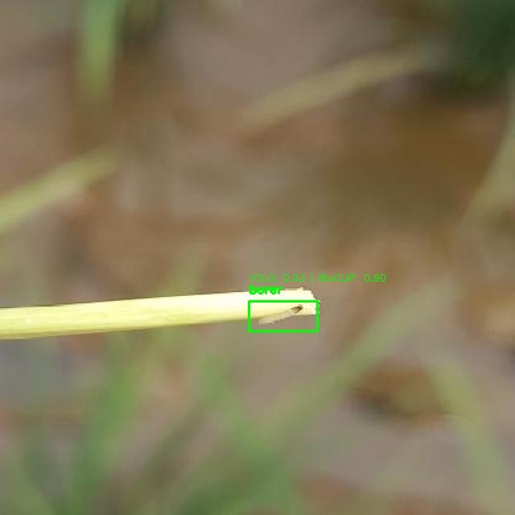
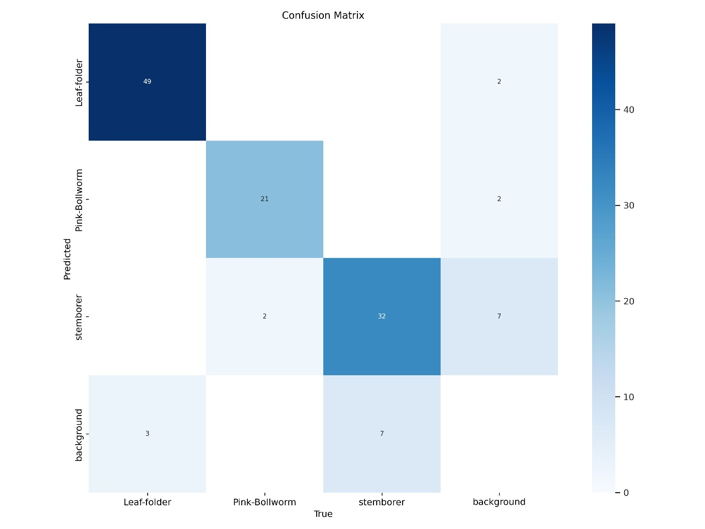
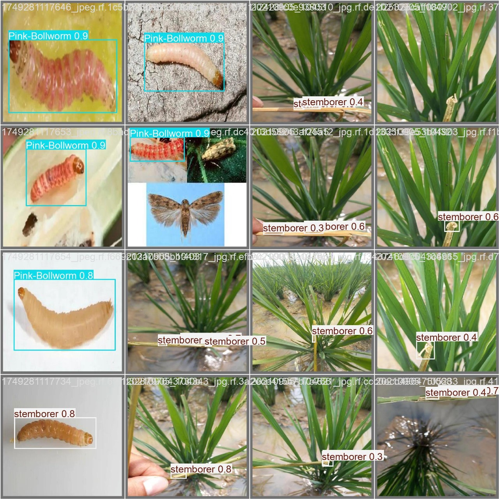

# Pest Detection using YOLOv11

This repository contains Jupyter Notebooks for pest detection using the YOLOv11 model. The project leverages Roboflow for dataset management and Ultralytics for model training and inference.

## Project Structure

- `Pest_Detection.ipynb`: Demonstrates the initial setup and training of a YOLOv11 model for pest detection.
- `Pest_detection_week_2.ipynb`: Enhances the first notebook by integrating **BioCLIP**, a vision-language model fine-tuned for biological images, enabling better generalization and few-shot learning in agricultural pest detection.

---

## 🔬 BioCLIP Integration

**BioCLIP** combines the visual reasoning of **CLIP (Contrastive Language–Image Pretraining)** with biological datasets, enhancing model understanding of subtle features in pest larvae and infested plants. In this project:

- YOLOv11 handles **object localization**.
- BioCLIP provides **semantic understanding** and **cross-validation** for zero-shot or few-shot pest classification.
- The two models work together, as shown in overlayed detections like:



---

## 📊 Example Results and Visualizations

### 🧠 Confusion Matrix

Evaluates classification accuracy for each pest class:



---

### 🐛 Detection Grid

Multiple detections using YOLOv11 with class labels and confidence scores:



---

### ✅ Detection Example (YOLOv11 + BioCLIP)

This image shows high-confidence detection using both YOLO and BioCLIP on the same crop:


---

## ⚙️ Setup and Installation

### 1. Clone the Repository

```bash
git clone https://github.com/your-username/your-repo-name.git
cd your-repo-name

    ```

2.  **Create a virtual environment (optional but recommended):**

    ```bash
    python -m venv venv
    source venv/bin/activate  # On Windows, use `venv\Scripts\activate`
    ```

3.  **Install dependencies:**

    The notebooks use `ultralytics`, `supervision`, `roboflow`, `transformers`, and `torch`. A `requirements.txt` file will be provided with the exact versions.

    ```bash
    pip install -r requirements.txt
    ```

4.  **Roboflow API Key:**

    Both notebooks utilize Roboflow for dataset access. You will need a Roboflow API key. It is highly recommended to store this key securely, for example, as an environment variable or using a secrets management service (like `google.colab.userdata.get` as seen in the notebooks).

    If you are running this locally, you can set it as an environment variable:

    ```bash
    export ROBOFLOW_API_KEY="YOUR_API_KEY"
    ```

## Usage

1.  **Open the notebooks:**

    You can open and run the Jupyter Notebooks using Jupyter Lab or Jupyter Notebook:

    ```bash
    jupyter lab
    ```
    or
    ```bash
    jupyter notebook
    ```

2.  **Run the cells:**

    Execute the cells in each notebook sequentially. The notebooks will handle downloading the dataset from Roboflow and training the YOLOv11 model.

## Example Results and Visualizations

Here are some examples of the pest detection results and visualizations from the notebooks:

### Detection Example


### Detection Grid


### Confusion Matrix


## Contributing

Feel free to fork this repository, make improvements, and submit pull requests. For major changes, please open an issue first to discuss what you would like to change.

## License

This project is licensed under the MIT License - see the `LICENSE` file for details.

## Acknowledgements

-   [Ultralytics YOLOv11](https://ultralytics.com/yolov11)
-   [Roboflow](https://roboflow.com/)
-   [Supervision](https://supervision.roboflow.com/)


